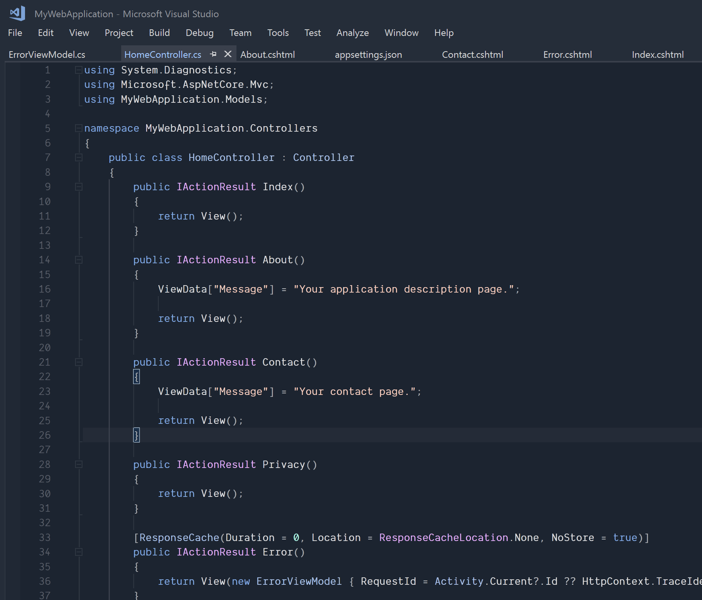

# Dainty for Visual Studio

Dainty is a configurable, refined, and balanced color theme using carefully selected colors within the CIELAB color space. It is designed to maximize readability and reduce eye strain.

For more information and web-based configuration, see https://dainty-vs.now.sh.

## Screenshot



## Features

- Precise and pleasant colors are generated and selected within the CIELAB color space
- Punctuation marks are slightly dimmed
- Left side of the editor is less busy than in the default themes
- Lightness of environment background and foreground can be adjusted
- Lightness of editor background and foreground can be adjusted
- Contrast for comments can be added
- Contrast for scrollbars can be added
- Transparent environment borders can be set
- Transparent scrollbar containers can be set
- Transparent tool window grip handles can be set
- Settings for Indent Guides extension can be included
- Colors can be lightened, darkened, or desaturated
- Colors can be overridden
- Usages of colors can be overridden
- Supports configuration presets

## Setup

    git clone https://github.com/alexanderte/dainty-vs.git
    cd dainty-vs
    npm install

## CLI usage

Run `npm run build` to generate the color theme files. This produces `dist/dainty.vstheme` and `dist/dainty.vssettings`.

`configuration.json` is used for configuration, and the file is created with default values if it doesn’t exist. The format of `configuration.json` is defined by [`configuration-schema.json`](https://github.com/alexanderte/dainty-vs/blob/master/configuration-schema.json).

## Configuration

Dainty can be configured by editing `configuration.json`. See [Configuration among applications](https://github.com/alexanderte/dainty-shared/blob/master/configuration-shared.md) for more details.

### Overriding usages of colors

Usages of environment colors and editor tokens can be overridden by adding the following object to the root of `configuration.json`:

```json
"replacements": {
  "overrides": {
    "searchReplace": {
      "#b5cea8": ["PURPLE_20", "PURPLE_20"]
    },
    "categories": {
      "ColorizedSignatureHelp colors": {
        "HTML Attribute Value": [[null, "BLUE_0"], [null, "BLUE_32"]]
      }
    }
  }
}
```

Each replacement is a tuple, where the first value represents the dark variation of the theme. The second value represents the light variation. For categories there is an inner tuple representing the background and text color, respectively.

## Server usage

Run `npm run start` to start Express server. These are the available routes:

| Method | Route                           | Description                                                         |
| ------ | ------------------------------- | ------------------------------------------------------------------- |
| `GET`  | `/`                             | Landing page                                                        |
| `GET`  | `/colors.html`                  | Color scales page                                                   |
| `GET`  | `/coverage.html`                | Coverage page                                                       |
| `GET`  | `/syntax.html`                  | Syntax page                                                         |
| `GET`  | `/dainty-latest.zip`            | Generates the latest version of Dainty with default configuration   |
| `POST` | `/dainty-latest-configured.zip` | Generates the latest version of Dainty with custom configuration[1] |

1. Custom configuration is sent as JSON using the request body, and the format is defined by [`configuration-schema.json`](https://github.com/alexanderte/dainty-vs/blob/master/configuration-schema.json).

## License

Dainty for Visual Studio is licensed under the [MIT License](https://github.com/alexanderte/dainty-vs/blob/master/license.md).
